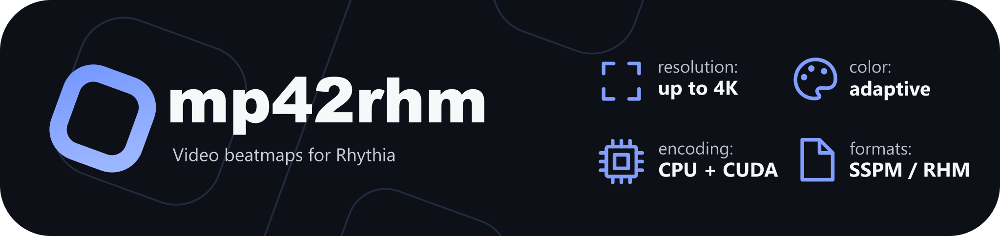

[](#getting-started)
[](CMakeLists.txt)
[](#features)
[](LICENSE)

## Introduction

mp42rhm converts videos into beatmaps for Rhythia. Written in C++17 for Windows, it exports SSPMv2 or RHM with embedded audio and a matching colorset.

## Getting Started

Download and extract the Windows x64 ZIP from [Releases](https://github.com/yo-ru/mp42rhm/releases), or [build from source](#building). The ZIP includes the C++ runtime; FFmpeg must be installed separately.

```powershell
winget install --id Gyan.FFmpeg -e
```

Reopen PowerShell in the extracted folder. Start with a short preview, then try a larger color export:

```powershell
.\mp42rhm.exe "video.mp4" preview --seconds 5
.\mp42rhm.exe "video.mp4" color --adaptive-palette --colors 256 --width 640 --height 360 --fps 12 --brush-size 32 --span 3.3
```

Exports write `<output>.sspm`, `<output>-colorset.txt`, and `<output>-settings.txt`. Existing files are never overwritten. Use `--format rhm` for RHM or `--mode grayscale` for grayscale.

Defaults are a small starting point: black and white, 160x90, 12 FPS, 100 million notes. Set `--width`, `--height`, `--fps`, and `--max-notes` to change them.

Run `--help` for common options, `--help-all` for every option, or `--version` when reporting an issue. [AGENTS.md](AGENTS.md) covers using mp42rhm through an AI assistant.

Tested with [Gyan FFmpeg 9.0.1 full](https://www.gyan.dev/ffmpeg/builds/). Both `ffmpeg` and `ffprobe` must be on PATH, or supplied with `--ffmpeg` and `--ffprobe`.

## Features

- Black and white, grayscale, and color. Grayscale defaults to 4 levels; color defaults to 64 colors.
- Global palettes up to 256 colors, or per-frame palettes up to 65,536 with `--adaptive-palette`.
- Resolution up to 3840x2160. `--fps` accepts decimals, fractions such as `24000/1001`, or `native`.
- Repeating BW/grayscale colorsets with `--compact-colorset`, using an extra analysis pass and offscreen filler notes.
- Text subtitles in a black band with `--subtitles N` (1-based track number).
- Experimental NVIDIA acceleration with `--experimental-cuda`.

Brushes support sizes 2..64, defaulting to 8 on CPU and 32 on CUDA. Use `--brush-size 1` for CPU pixel mode. Ordinary BW uses pixel mode by default.

<details>
<summary>CUDA setup (optional)</summary>

Install an NVIDIA driver and [CUDA Toolkit 12 or 13](https://developer.nvidia.com/cuda-downloads), including NVRTC. In PowerShell:

```powershell
$env:Path = "$env:CUDA_PATH\bin;$env:CUDA_PATH\bin\x64;$env:Path"
```

Add `--experimental-cuda` to a color, grayscale, or compact BW export. Alternatively, place `nvrtc64_120_0.dll` or `nvrtc64_130_0.dll` and the matching `nvrtc-builtins64_*.dll` from the same toolkit beside `mp42rhm.exe`. See [NVIDIA's NVRTC layout](https://docs.nvidia.com/cuda/nvrtc/index.html#installation).
</details>

## How It Works

1. FFmpeg decodes and scales frames, preserving aspect ratio with padding.
2. Frames are thresholded for BW or quantized to a grayscale or color palette without dithering.
3. Pixel mode places one note per visible pixel. Brush mode paints with overlapping squares, comparing 16 painting orders and optimizing the best two results to remove notes while preserving the quantized pixels.
4. Note order is compensated for Rhythia's sorting and reverse draw order. Notes are packaged with MP3 audio and a matching colorset.

Colorsets use bare `RRGGBB` lines, 7 bytes per entry. Brush exports normally need one entry per note; compact mode reuses a short sequence. `--colors` controls palette size, not colorset length.

## Playback

Import the map and matching colorset, then apply the values in `<output>-settings.txt`. Use solid square notes, 1x speed, and Visualize (Auto). Brush maps require Note Opacity 100% and Fade Length 0.

Start at FOV 30. `--span 3.3` targets near-screen width for a 16:9 picture; increase FOV if it clips. Note Scale and coordinate spacing are adjusted together to the nearest two-decimal scale, with a minimum of 0.01, so the final span can differ. Screen size also depends on aspect ratio and your game settings.

`--max-notes` stops an export at its budget; it does not automatically lower quality. Colorset import memory and peak notes per frame can limit playback even when encoding succeeds. Supported resolution and FPS are export limits, not performance guarantees. Large conversions also need temporary disk space beyond the final file sizes.

## Building

Requires Visual Studio 2022 with Desktop development with C++, CMake 3.24+, Git, and FFmpeg/ffprobe. Run from Developer PowerShell for VS 2022, or put CMake on PATH.

```powershell
git clone https://github.com/yo-ru/mp42rhm.git
cd mp42rhm
cmake -S . -B build -A x64
cmake --build build --config Release
ctest --test-dir build -C Release --output-on-failure
```

The executable is `build/Release/mp42rhm.exe`. CMake downloads rhmParse automatically. To create the Windows ZIP, run `cpack -C Release --config build/CPackConfig.cmake -B build`.

## License

MIT. See [LICENSE](LICENSE) and [third-party notices](licenses/).

The Rhythia name and logo, property of [CAPO GAMES S.R.L.](https://www.capo.games/), are excluded from this license.
