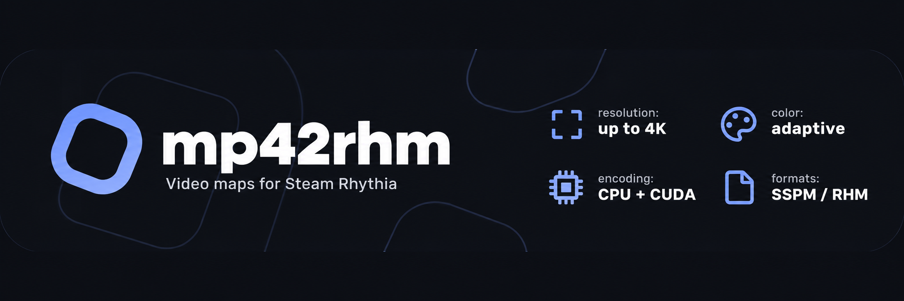

[](#getting-started)
[](CMakeLists.txt)
[](#features)
[](LICENSE)

## Introduction

mp42rhm converts videos into note maps for Steam Rhythia. Written in C++17 for Windows, it exports SSPM v2 or RHM with embedded audio and a matching colorset.

## Getting Started

Requires Visual Studio 2022 C++ tools, CMake 3.24+, Git, and FFmpeg/ffprobe on PATH.

```powershell
cmake -S . -B build -A x64
cmake --build build --config Release
ctest --test-dir build -C Release --output-on-failure
```

```powershell
.\build\Release\mp42rhm.exe video.mp4 bw
.\build\Release\mp42rhm.exe video.mp4 gray --mode grayscale
.\build\Release\mp42rhm.exe video.mp4 color --adaptive-palette --colors 256
```

Each command writes `<output>.sspm` and `<output>-colorset.txt`. Use `--format rhm` for RHM or `--seconds 5` for a preview.

Defaults: black and white, 160x90, 12 FPS, 100 million notes. Set `--width`, `--height`, `--fps`, and `--max-notes` to change them.

Run `--help` for common options or `--help-all` for every option. [AGENTS.md](AGENTS.md) covers exports through an AI assistant.

## Features

- Black and white, grayscale, and color. Grayscale defaults to 4 levels; color defaults to 64 colors.
- Global palettes up to 256 colors, or per-frame palettes up to 65,536 with `--adaptive-palette`.
- Resolution up to 3840x2160. `--fps` accepts decimals, fractions such as `24000/1001`, or `native`.
- Repeating BW/grayscale colorsets with `--compact-colorset`, using an extra analysis pass and offscreen filler notes.
- Text subtitles in a black band with `--subtitles N` (1-based track number).
- Experimental NVIDIA acceleration with `--experimental-cuda`.

CPU encoding is the default. CUDA requires an NVIDIA driver and CUDA 12/13 NVRTC with its matching builtins DLL beside the executable or on PATH. It supports color, grayscale, and compact BW brushes.

Brushes support sizes 2..64, defaulting to 8 on CPU and 32 on CUDA. Use `--brush-size 1` for CPU pixel mode. Ordinary BW uses pixel mode by default.

## How It Works

1. FFmpeg decodes and scales frames, preserving aspect ratio with padding.
2. Frames are thresholded for BW or quantized to a grayscale or color palette without dithering.
3. Pixel mode places one note per visible pixel. Brush mode paints with overlapping squares, comparing 16 painting orders and optimizing the best two results to remove notes while preserving the quantized pixels.
4. Note order is compensated for Rhythia's sorting and reverse draw order. Notes are packaged with MP3 audio and a matching colorset.

Colorsets use bare `RRGGBB` lines, 7 bytes per entry. Brush exports normally need one entry per note; compact mode reuses a short sequence. `--colors` controls palette size, not colorset length.

## Playback

Import the map and colorset, then apply the printed Note Scale, AR, SD, and background RGB. Use solid square notes, 1x speed, and Visualize (Auto). Brush maps require Note Opacity 100% and Fade Length 0.

## License

MIT. See [LICENSE](LICENSE) and [third-party notices](licenses/).

The Rhythia name and logo, property of [CAPO GAMES S.R.L.](https://www.capo.games/), are excluded from this license.
